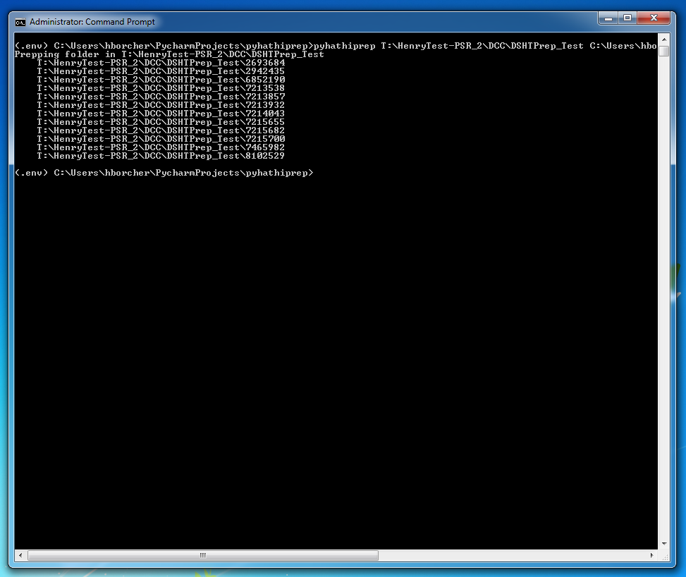

This is a command line script so you will need a terminal window open to use it.

Prep HathiTrust packages
------------------------

To prep package for submitting to HathiTrust, type "pyhathiprep" followed by two directories.

1. The first path contains all the directory that need to be prepped.

2. The second path is the destination the script should save the packages prepped for HathiTrust.

For example: :command:`pyhathiprep T:\\lab_production C:\\Users\\hborcher\\NewHathiPackages`

.. Note::
    If the path has spaces in it, you must surround the path by quotes.

    :command:`pyhathiprep "T:\\lab packages" "C:\\Users\\hborcher\\Hathi Packages"`

The Help Screen
---------------
This documentation should be up to date. However, you can always type ``pyhathiprep -h`` or
``pyhathiprep --help`` into a command prompt to display the script usage instructions along with any
additional the options.

.. code-block:: console

    usage: pyhathiprep [-h] [--version] [--dest DEST] [-o] [--debug]
                   [--log-debug LOG_DEBUG]
                   source

    Replacement for HathiPrep script

    positional arguments:
      source                Path to the source directory of files that need to be
                            prepped

    optional arguments:
      -h, --help            show this help message and exit
      --version             show program's version number and exit
      --dest DEST           Path to save new hathi prep.
      -o, --overwrite       Overwrite any existing files and folders

    Debug:
      --debug               Run script in debug mode
      --log-debug LOG_DEBUG
                            Save debug information to a file

It's that simple!